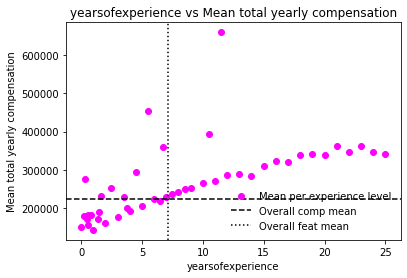
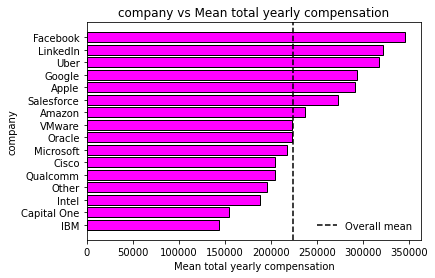
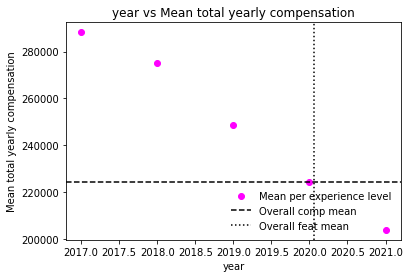
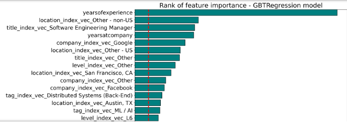

## Predicting annual remuneration for STEM professionals

<!DOCTYPE html>
<html>
<head>
  
</head>
<body>

<table border="1">
  <tr>
    <td>
      <figure>
        
      </figure>
    </td>
    <td>
      <figure>
        
      </figure>
    </td>
    <td>
      <figure>
        
      </figure>
    </td>
    <td>
      <figure>
        
      </figure>
    </td>
  </tr>
  <tr>
    <th>Mean salary by experience</th>
    <th>Mean salary by company</th>
    <th>Mean salary by year</th>
    <th>Feature importance</th>
  </tr>
</table>

</body>
</html>

### Project objectives

1. Build a model to predict a person's expected remuneration for any role in the STEM sector based on attribute profiles of the role and the person
2. Use big data tools to build the model to enable efficient processing of data features comprising extreme cardinality
  
### Analysis approach

Using PySpark, PySpark SQL and Python where appropriate in a Jupyter Notebook to:
1. Create a Spark session on an available Cluster and upload the data onto Hadoop Distributed File System
2. Convert the data into a dataframe ahead of analysis and undertake a data audit and exploratory data analysis to gain insights on the main features
3. Clean and transform the data as required and build new features
4. Use Spark ML to create transformers and estimators to build predictive models
5. Create pipelines to find the best predictive model using different algorithms, different number of input features and hyperparameter tuning
6. Contemplate what extra steps could make the final model better

cf. code 'stem-jobs-salary-prediction.ipynb'

### Results/findings

- The best model was a Gradient Boosted Trees (GBT) regressor model which explained 64% of the variance and had a high RMSE
- To improve the model tried re-training the GBT regressor over various numbers of features (10, 20, 30,...) using feature importance rankings and tuning the hyperparameters of each using grid search and Spark ML CrossValidator. This increased the explained variance by 0.5 percentage points
- The top features in terms of feature importance were generally intuitive. For example 'years of experience', 'years at company', job titles involving 'software engineering', place of work being 'Google', tag of 'AI/ML', holding a 'PhD' are all significant drivers of higher remuneration. However, a counter intuitive finding was the work 'location' outside of California having a higher feature ranking than 'location' of California. The features of 'race' and 'gender' are quite low in the feature importance rankings.

